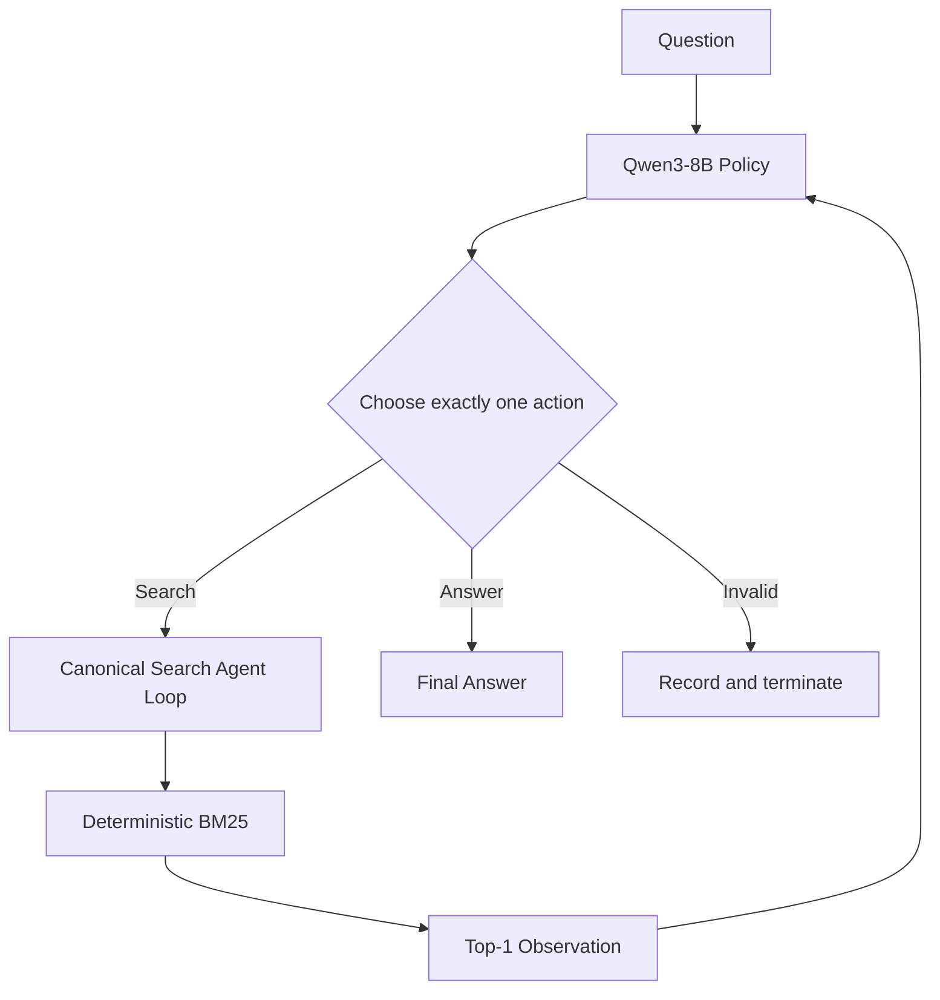

<p align="center">
  
</p>

<h1 align="center">SearchAgent-RL</h1>

<p align="center">
  <strong>Reinforcement Learning for Multi-turn Search Agents</strong>
</p>

<p align="center">
  Training Qwen3-8B to search, observe, decide, and answer through multi-turn interaction.
</p>

<p align="center">
  
  
  
  
  
</p>

<picture>
  <source media="(prefers-color-scheme: dark)" srcset="assets/hero-dark.svg">
  <source media="(prefers-color-scheme: light)" srcset="assets/hero-light.svg">
  
</picture>

**SearchAgent-RL** is a reproducible Agentic RL project for training Qwen3-8B to
solve multi-hop QA through multi-turn search.

Beyond final-answer accuracy, it measures how reinforcement learning changes the
agent's **exploration depth, evidence acquisition, stopping behavior, and action
validity**.

## Results at a Glance

Natural Bridge-Hard evaluation, 200 HotpotQA validation examples:

| Metric           |   Base | Vanilla GRPO |
| ---------------- | -----: | -----------: |
| EM ↑             |  32.5% |    **51.5%** |
| F1 ↑             | 42.03% |   **62.53%** |
| Multi-search ↑   |  31.5% |    **86.0%** |
| Invalid Action ↓ | 10.06% |    **0.17%** |

**GRPO improves more than answer accuracy.** The trained policy becomes
substantially more likely to perform multi-step retrieval while almost
eliminating invalid actions.

---

## Task Setting & Motivation

### Why Multi-turn Search?

SearchAgent-RL studies **bridge-style multi-hop QA** in a controlled retrieval
environment.

The agent receives a question, but not the answer. It can interact with a BM25
search environment and must decide whether the currently retrieved evidence is
sufficient or another search is required.

A typical episode has an information dependency:

```text
Question
   │
   ▼
Search #1
   │
   ▼
Bridge entity
   │
   ▼
Search #2 conditioned on that entity
   │
   ▼
Answer evidence
   │
   ▼
Final answer
```

The second query may only become obvious after observing the first retrieval:

$$
q_{t+1}=f(q,h_t,o_t),
$$

where $h_t$ is the interaction history and $o_t$ is the latest observation.

This makes the task fundamentally different from one-shot retrieval: the agent
must repeatedly decide **what to search for, whether to continue searching, and
when to answer**.

### Why Reinforcement Learning?

At each assistant turn, the policy chooses one of two actions:

$$
a_t \in
\{\mathrm{Search}(query), \mathrm{Answer}(text)\}.
$$

Supervised Tool Calling examples can teach valid action syntax, but multi-turn
search additionally requires a sequential policy over complete trajectories.

GRPO provides feedback at the trajectory level, allowing alternative
search-and-answer strategies for the same question to compete against each
other.

### Deterministic Search Environment

SearchAgent-RL uses a controlled **BM25 retrieval environment** built from the distractor passages associated with each HotpotQA example.

For every search action, the agent issues a free-form query and receives the **top-1 BM25 passage** as its next observation. Retrieval is deterministic: the same query over the same example-level corpus always produces the same result.

This design intentionally avoids search-engine stochasticity. It makes changes in behavior—such as query formulation, repeated search, multi-hop exploration, and stopping decisions—easier to attribute to the learned policy rather than to the retrieval backend.

The current setup is therefore a **controlled multi-hop search testbed**, not an open-web search environment.

---

## Agent Loop



Each assistant turn emits exactly one action.

**Search**

```xml
<tool_call>
{"name":"search","arguments":{"query":"Hunter Davies born"}}
</tool_call>
```

**Answer**

```xml
<answer>7 January 1936</answer>
```

| Constraint                |        Value |
| ------------------------- | -----------: |
| Maximum assistant turns   |            5 |
| Maximum executed searches |            3 |
| Parallel calls per turn   |            1 |
| Results per search        |            1 |
| Observation limit         |   384 tokens |
| Response trajectory limit | 1,024 tokens |

A search observation is appended to the context before the next policy decision.

Malformed, mixed, unknown, or over-budget actions are recorded instead of being
silently executed. An episode terminates on a valid answer, budget exhaustion,
or protocol failure.

The project-local
[`CanonicalToolAgentLoop`](src/efficienttool_rl/verl/canonical_agent_loop.py)
aligns local evaluation with verl's native asynchronous `ToolAgentLoop` without
modifying upstream verl.

Parser and protocol handling live in
[`protocol.py`](src/efficienttool_rl/protocol.py).

---

## Example: A Two-hop Search Trajectory

A real successful Natural Bridge-Hard trajectory:

```text
Question:
When was the British author who wrote the novel on which
"Here We Go Round the Mulberry Bush" was based born?

Turn 1 — Search:
British author novel Here We Go Round the Mulberry Bush

Observation:
The 1967 British film was based on the novel of the same name
by Hunter Davies.

Turn 2 — Search:
Hunter Davies born

Observation:
Edward Hunter Davies, OBE (born 7 January 1936) is a British author,
journalist and broadcaster.

Final Answer:
<answer>7 January 1936</answer>
```

The first search discovers the bridge entity **Hunter Davies**. The second query
is then conditioned on that newly observed entity and retrieves the answer
evidence.

That dependency is the core behavior studied by SearchAgent-RL.

---

## Agentic RL Pipeline

For every question, the policy samples a group of complete multi-turn
trajectories:


A trajectory can contain multiple policy decisions and environment observations:

```text
question
  → search
  → observation
  → search
  → observation
  → answer
```

With 32 questions and 4 rollouts per question, one optimizer update samples
**128 complete agent trajectories**.

---

## Reinforcement Learning with GRPO

For each question $q$, GRPO samples:

$$
\{\tau_1,\ldots,\tau_G\}\sim\pi_\theta,
\qquad G=4.
$$

Rewards are normalized within the group:

$$
A_i=
\frac{R_i-\mu_R}
{\sigma_R+\epsilon}.
$$

A trajectory that performs better than alternative trajectories for the same
question receives positive advantage; weaker trajectories receive negative
advantage.

The policy is updated with a clipped objective and no learned critic.

The main Vanilla GRPO run uses:

- Qwen3-8B;
- 2,000 training prompts;
- 4 trajectories per prompt;
- 62 optimizer updates;
- asynchronous vLLM rollout;
- PyTorch FSDP + Ray;
- actor KL coefficient `0.001`.

The run had a zero-variance group ratio of `0.684`, yet still produced a large
improvement on the evaluation set.

See the exact [`GRPO configuration`](configs/grpo/qwen8b_hotpot_mt_strict.yaml).

---

## Reward Engineering

### Task-only Reward

The strongest-performing training recipe uses only final-answer quality:

$$
R_{\text{answer}} = 0.5\,EM+0.5\,F1.
$$

A response without exactly one valid terminal `<answer>` receives zero reward.

Importantly, this objective does **not** directly reward search depth,
supporting-document retrieval, or tool usage.

Nevertheless, Vanilla GRPO increases multi-search from **31.5% to 86.0%**,
showing that stronger multi-step retrieval behavior can emerge from
trajectory-level outcome supervision alone.

### Process-aware Reward v2

We also study whether explicit process shaping can reduce unnecessary retrieval.

Reward v2 uses:

$$
R=
R_{\text{answer}}
+\beta_tR_{\text{evidence}}
-\lambda R_{\text{answer}}N_{\text{no-new-support}},
$$

with

$$
\beta_t:0.10\rightarrow0,
\qquad
\lambda=0.02.
$$

It contains three design choices:

**Evidence shaping.** Each search is analyzed according to whether it discovers
a previously unseen gold supporting document. Duplicate or irrelevant retrieval
contributes no new evidence gain.

**Annealing.** The evidence coefficient decays with global optimizer progress so
that training gradually returns toward answer-quality optimization.

**Success-gated retrieval regularization.** Searches that retrieve no new gold
supporting document receive only a weak penalty proportional to final answer
quality. This prevents the reward from directly favoring premature stopping.

The current implementation still supplies GRPO with a **trajectory-level scalar
reward**. Per-search evidence gains are useful diagnostics, but they do not
constitute action-local policy-gradient credit.

Gold answers and supporting-document annotations are reward-only metadata and
are never exposed in the model prompt, search query, or tool observation.

See [`reward_v2.py`](src/efficienttool_rl/rewards/reward_v2.py) and its
[`training config`](configs/grpo/qwen8b_hotpot_reward_v2.yaml).

### Training Dynamics

The comparison below is aggregated directly from all 62 rollout steps and the
eight observed Hotpot-MT Strict validation checkpoints for both Vanilla GRPO
and Reward v2. Training lines show a five-step centered rolling mean over faint
raw values; validation points are not interpolated.


The individual run exports retain diagnostic detail:

- [Vanilla GRPO overview](assets/training-curves/vanilla-grpo/training_overview.svg)
  and [optimization health](assets/training-curves/vanilla-grpo/optimization_health.svg)
- [Reward v2 overview](assets/training-curves/reward-v2/training_overview.svg),
  [optimization health](assets/training-curves/reward-v2/optimization_health.svg),
  and [reward components](assets/training-curves/reward-v2/reward_components.svg)
- [Comparison metrics](assets/training-curves/grpo-comparison/metrics_long.csv)
  and [plot manifest](assets/training-curves/grpo-comparison/plot_manifest.json)

The CSV exports and sanitized manifests make every plotted point auditable
without publishing machine-specific paths.

These in-training validation curves use the 100-example strict validation
split. The Natural Bridge-Hard results reported below remain the external
200-example evaluation comparison.

### Reward Evolution

| Version        | Main design                                                        | Result                                                        |
| -------------- | ------------------------------------------------------------------ | ------------------------------------------------------------- |
| Composite v1   | Answer + final evidence coverage + format                          | Improves over Base, but increases unnecessary retrieval       |
| Reward v2      | Annealed evidence shaping + success-gated retrieval regularization | Similar task quality to v1 with fewer no-new-support searches |
| Task-only GRPO | Answer reward only                                                 | **Best overall EM/F1**                                        |

Reward v2 is therefore a **performance–retrieval-cost trade-off**, not a Pareto
improvement over task-only GRPO.

The Composite v1 offline analysis is available in
[`analysis/composite_reward_pilot`](analysis/composite_reward_pilot/README.md).

---

## Evaluation Results

All methods below use the same **Natural Bridge-Hard evaluation protocol**:

- 200 official HotpotQA validation examples;
- `type = bridge`;
- `level = hard`;
- deterministic top-1 BM25 retrieval;
- identical turn and search budgets;
- 384-token observations.

### Task Quality

| Method           |      EM ↑ |       F1 ↑ |
| ---------------- | --------: | ---------: |
| Base             |     32.5% |     42.03% |
| **Vanilla GRPO** | **51.5%** | **62.53%** |
| Composite v1     |     45.0% |     55.25% |
| Reward v2        |     45.5% |     56.83% |

### Search Behavior

| Method           | Searches | Multi-search ↑ | Support-hit | No-new-support ↓ | Support-hit Rate ↑ | Invalid Action ↓ |
| ---------------- | -------: | -------------: | ----------: | ---------------: | -----------------: | ---------------: |
| Base             |    1.335 |          31.5% |       0.965 |            0.370 |             72.28% |           10.06% |
| **Vanilla GRPO** |    1.960 |      **86.0%** |   **1.445** |            0.515 |             73.72% |        **0.17%** |
| Composite v1     |    1.885 |          77.5% |       1.250 |            0.635 |             66.31% |            0.52% |
| Reward v2        |    1.675 |          64.0% |       1.250 |        **0.425** |         **74.63%** |            0.37% |

**Support-hit** means that an executed search retrieves at least one previously
unseen gold supporting document.

**No-new-support** is the complementary annotation-based proxy: the search
executed successfully but added no new gold supporting document. It should not
be interpreted as a perfect causal measure of whether the retrieval was useful
to the model.

### Key Findings

**1. Vanilla GRPO gives the strongest overall policy.**

It improves both task quality and multi-step exploration:

$$
EM:\ 32.5\%\rightarrow51.5\%
$$

$$
MultiSearch:\ 31.5\%\rightarrow86.0\%.
$$

**2. Search count alone is not an efficiency metric.**

GRPO increases both support-hit and no-new-support retrieval. Search behavior
therefore needs to be evaluated jointly with final task quality.

**3. Explicit process shaping introduces a trade-off.**

Reward v2 reduces no-new-support retrieval relative to Composite v1 while
maintaining similar answer quality, but it still trails task-only GRPO on EM/F1.

### Larger-scale checkpoint comparison

To test whether that conclusion depends on the original 200-example set, the
two principal step-62 checkpoints were also evaluated on 1,000 aligned Natural
Bridge-Hard examples:

| Method | EM | F1 | Searches | Multi-search | Support-hit | No-new-support |
| --- | ---: | ---: | ---: | ---: | ---: | ---: |
| **Vanilla GRPO** | **48.3%** | **62.03%** | 1.959 | **84.2%** | **1.407** | 0.552 |
| Reward v2 | 43.6% | 56.99% | **1.638** | 59.9% | 1.239 | **0.399** |

Paired bootstrap intervals confirm the answer-quality gap: Vanilla GRPO leads
by **4.70 EM points** (95% CI: +2.80 to +6.70) and **5.03 F1 points** (95% CI:
+3.12 to +7.00). Reward v2 reduces absolute retrieval cost, but also retrieves
less annotated supporting evidence and remains weaker on answer quality.

Complete experiment provenance and artifact hashes are recorded in
[`experiments/results.md`](experiments/results.md).

---

## Engineering & Reproducibility

| Layer                | Implementation                                |
| -------------------- | --------------------------------------------- |
| Base model           | Qwen3-8B, bf16                                |
| RL training          | verl + GRPO                                   |
| Rollout              | vLLM 0.11.0 async generation                  |
| Distributed training | PyTorch FSDP + Ray                            |
| Search environment   | Deterministic per-trajectory BM25             |
| Agent runtime        | Native ToolAgentLoop + CanonicalToolAgentLoop |
| Dataset              | HotpotQA multi-hop QA                         |
| Evaluation           | Answer quality + search-policy behavior       |
| Tests                | 108 unit/integration tests                    |

Upstream verl remains unmodified. Project-specific agent-loop and reward-manager
integrations are isolated under
[`src/efficienttool_rl/verl`](src/efficienttool_rl/verl/).

Completed experiments record:

- training configuration;
- random seed;
- dataset fingerprint;
- checkpoint step;
- evaluation protocol;
- trajectory artifact IDs;
- SHA-256 hashes for published evaluation outputs.

See [`experiments/results.md`](experiments/results.md) for the canonical
experiment table.

---

## Getting Started

The shortest path to a training run is: install the project, prepare Qwen3-8B,
materialize HotpotQA, launch Vanilla GRPO, and evaluate the resulting
checkpoint.

### 1. Prepare the environment

```bash
git clone https://github.com/Idiotyevsky/SearchAgent-RL.git
cd SearchAgent-RL

python -m venv .venv
source .venv/bin/activate
pip install -e ".[data,hf,rl]"
```

The training path additionally requires a compatible verl, vLLM, PyTorch, and
CUDA installation. See the exact tested versions in
[`docs/environment_report.md`](docs/environment_report.md) before installing the
GPU stack.

### 2. Prepare Qwen3-8B

SearchAgent-RL uses a local Hugging Face-format **Qwen3-8B** checkpoint that
must be loadable by both Transformers and vLLM:

```bash
export ETRL_MODEL=/path/to/Qwen3-8B
hf download Qwen/Qwen3-8B --local-dir "$ETRL_MODEL"
```

Skip the download command when the checkpoint already exists locally; set
`ETRL_MODEL` to that directory instead.

### 3. Prepare HotpotQA

First download and normalize the official distractor splits:

```bash
export ETRL_DATA_DIR="$PWD/data/processed"
mkdir -p "$ETRL_DATA_DIR"

python scripts/prepare_hotpotqa.py \
  --split train \
  --output-dir "$ETRL_DATA_DIR"

python scripts/prepare_hotpotqa.py \
  --split validation \
  --output-dir "$ETRL_DATA_DIR"
```

Then create the exact training and evaluation artifacts used by this project:

```bash
python scripts/prepare_verl_hotpotqa.py \
  --input "$ETRL_DATA_DIR/hotpotqa_distractor_train.jsonl" \
  --output "$ETRL_DATA_DIR/verl_hotpotqa_mt_strict_train_2000.parquet" \
  --split train \
  --limit 2000 \
  --question-type bridge \
  --levels medium hard \
  --require-two-hop \
  --max-observation-tokens 384 \
  --max-top-k 1 \
  --max-executed-search-calls 3 \
  --data-source hotpotqa_multi_turn_strict

python scripts/prepare_verl_hotpotqa.py \
  --input "$ETRL_DATA_DIR/hotpotqa_distractor_validation.jsonl" \
  --output "$ETRL_DATA_DIR/verl_hotpotqa_mt_strict_val_100.parquet" \
  --split validation \
  --limit 100 \
  --question-type bridge \
  --levels hard \
  --require-two-hop \
  --max-observation-tokens 384 \
  --max-top-k 1 \
  --max-executed-search-calls 3 \
  --data-source hotpotqa_multi_turn_strict

python scripts/prepare_verl_hotpotqa.py \
  --input "$ETRL_DATA_DIR/hotpotqa_distractor_validation.jsonl" \
  --output "$ETRL_DATA_DIR/verl_hotpotqa_mt_natural_bridge_hard_val_200.parquet" \
  --split validation \
  --limit 200 \
  --question-type bridge \
  --levels hard \
  --max-observation-tokens 384 \
  --max-top-k 1 \
  --max-executed-search-calls 3 \
  --data-source hotpotqa_natural_bridge_hard
```

The directory should now contain these three experiment inputs and a manifest
for each one:

```text
data/processed/
├── verl_hotpotqa_mt_strict_train_2000.parquet
├── verl_hotpotqa_mt_strict_val_100.parquet
└── verl_hotpotqa_mt_natural_bridge_hard_val_200.parquet
```

### 4. Train Vanilla GRPO

```bash
export VERL_CONFIG_PATH=/path/to/verl/verl/trainer/config
export ETRL_ROOT="$PWD"
export ETRL_RUN_DIR=/path/to/run-output

python scripts/train_grpo.py \
  --config-name qwen8b_hotpot_mt_strict
```

The config reads `ETRL_MODEL` and `ETRL_DATA_DIR` from the earlier steps. Use a
new `ETRL_RUN_DIR` to avoid mixing outputs from different runs.

### 5. Evaluate

```bash
python scripts/evaluate.py \
  --data "$ETRL_DATA_DIR/verl_hotpotqa_mt_natural_bridge_hard_val_200.parquet" \
  --model /path/to/checkpoint \
  --output /path/to/eval/trajectories.jsonl \
  --backend vllm \
  --limit 200 \
  --max-turns 5 \
  --max-search-calls 3 \
  --top-k 1 \
  --max-top-k 1 \
  --max-observation-tokens 384
```

Methods should be compared under identical search budgets and evaluation
settings.

### MuSiQue local-corpus adapter

The original HotpotQA pipeline remains available unchanged. For longer
2/3/4-hop chains, [official MuSiQue-Answerable JSONL](https://github.com/stonybrooknlp/musique)
can be converted while retaining its per-example passage set:

```bash
python scripts/prepare_verl_musique.py \
  --input /path/to/musique_ans_v1.0_train.jsonl \
  --output "$ETRL_DATA_DIR/verl_musique_ans_train_2000.parquet" \
  --split train \
  --limit 2000

python scripts/prepare_verl_musique.py \
  --input /path/to/musique_ans_v1.0_dev.jsonl \
  --output "$ETRL_DATA_DIR/verl_musique_ans_dev_300.parquet" \
  --split dev \
  --per-hop-limit 100
```

The adapter preserves hop count and answer aliases as evaluation metadata,
keeps gold decomposition/support labels out of model-visible context, and
reports evaluation metrics separately for 2-, 3-, and 4-hop examples. When
different MuSiQue paragraphs share a title, stable paragraph-qualified labels
keep evidence accounting document-unique without changing HotpotQA titles.

A separate task-only recipe is provided as
[`qwen8b_musique_local.yaml`](configs/grpo/qwen8b_musique_local.yaml).
Shared-corpus retrieval is intentionally a later stage so hop depth and corpus
scale can be measured independently.

Zero-shot transfer from HotpotQA training has been evaluated on a balanced
300-example MuSiQue set with 100 examples at each of 2, 3, and 4 hops. The
interaction budget was expanded uniformly to 8 assistant turns and 6 searches:

| Policy | EM | F1 | Searches | Multi-search | Invalid action |
| --- | ---: | ---: | ---: | ---: | ---: |
| Qwen3-8B Base | 9.33% | 17.19% | 1.917 | 66.00% | 7.05% |
| Vanilla GRPO, step 62 | **16.33%** | **26.22%** | 2.657 | **97.00%** | **0.09%** |
| Reward v2, step 62 | 13.33% | 22.18% | 2.233 | 90.67% | 0.72% |

Vanilla GRPO transfers best overall, with the clearest gain at 2 hops and a
smaller gain at 4 hops. The 3-hop subset remains difficult for all three
policies. See the [full generalization results](experiments/results.md#zero-shot-musique-234-hop-transfer)
for per-hop metrics, protocol details, fingerprints, and artifact hashes.

---

## Development & Validation

Development checks are separate from the user-facing training path:

```bash
pip install -e ".[test]"

# CPU-only parser and BM25 smoke; no model download required
PYTHONPATH=src python examples/01_tool_calling.py

# Full suite; requires the validated verl environment
pytest -q

# Model-backed AgentRunner smoke
python scripts/smoke_agent_episode.py \
  --model "$ETRL_MODEL" \
  --device cuda:0
```

The CPU example validates the action parser and search tool. The full suite also
covers verl adapters, while the model-backed smoke verifies a generated Tool
Call, observation feedback, and final answer.

### Regenerate Training Curves

```bash
pip install -e ".[plot]"

python scripts/plot_training_curves.py \
  --run "Vanilla GRPO=/path/to/run/qwen8b_grpo_hotpot_mt_strict_2000_seed42_retry1" \
  --log "Vanilla GRPO=/path/to/run/vanilla-grpo.log" \
  --run "Reward v2=/path/to/run/qwen8b_grpo_reward_v2_hotpot_mt_strict_2000_seed42" \
  --log "Reward v2=/path/to/run/train.log" \
  --output-dir assets/training-curves/grpo-comparison \
  --formats png svg
```

Pass repeated `--run LABEL=DIR` and `--log LABEL=FILE` arguments to overlay
comparable runs. If training resumed, pass its console logs in chronological
order under the same label; metrics from later logs replace duplicate steps.

---

## Additional Studies

### Composite Reward v1

An earlier reward combined answer quality, final supporting-document coverage,
and protocol-format signals.

Offline analysis showed that supporting-document coverage carries useful signal
while format validity is already near ceiling. This motivated the simpler Reward
v2 design.

See the [`Composite Reward Pilot`](analysis/composite_reward_pilot/README.md).

### DAPO

DAPO-style training was evaluated as an auxiliary study.

In the current setting it converged toward a conservative one-search policy and
did not outperform Vanilla GRPO. Because DAPO is not part of the main project
claim, the detailed investigation is kept separate:

[`DAPO Diagnosis`](analysis/dapo_diagnostics/README.md)

---

## Repository Structure

```text
SearchAgent-RL/
├── configs/                  # Training and search-loop configurations
├── src/efficienttool_rl/     # Stable Python import package
│   ├── tools/                # Deterministic BM25 search
│   ├── rewards/              # Task and process-aware rewards
│   ├── evaluation/           # Task and behavioral metrics
│   └── verl/                 # Agent-loop and reward-manager adapters
├── scripts/                  # Data, training, evaluation, and analysis CLIs
├── experiments/              # Verified results and provenance
├── analysis/                 # Focused reward and auxiliary studies
├── tests/                    # Unit and integration tests
├── docs/archive/             # Historical plans and superseded narratives
├── AGENTS.md                 # Research-engineering conventions
└── PROGRESS.md               # Current experiment status
```

The source package remains `efficienttool_rl` for compatibility with existing
runs and artifacts.

---

## Scope

SearchAgent-RL is intentionally a **controlled multi-hop retrieval testbed**.

The current environment searches the distractor passages associated with each
HotpotQA example using deterministic BM25 rather than an open-web search engine.

This design trades environment breadth for experimental control: changes in
retrieval behavior are easier to attribute to RL training when the corpus,
search backend, and interaction budget are fixed.

The project therefore studies:

> **how reinforcement learning shapes sequential search policies**

rather than claiming general-purpose web-search capability.
